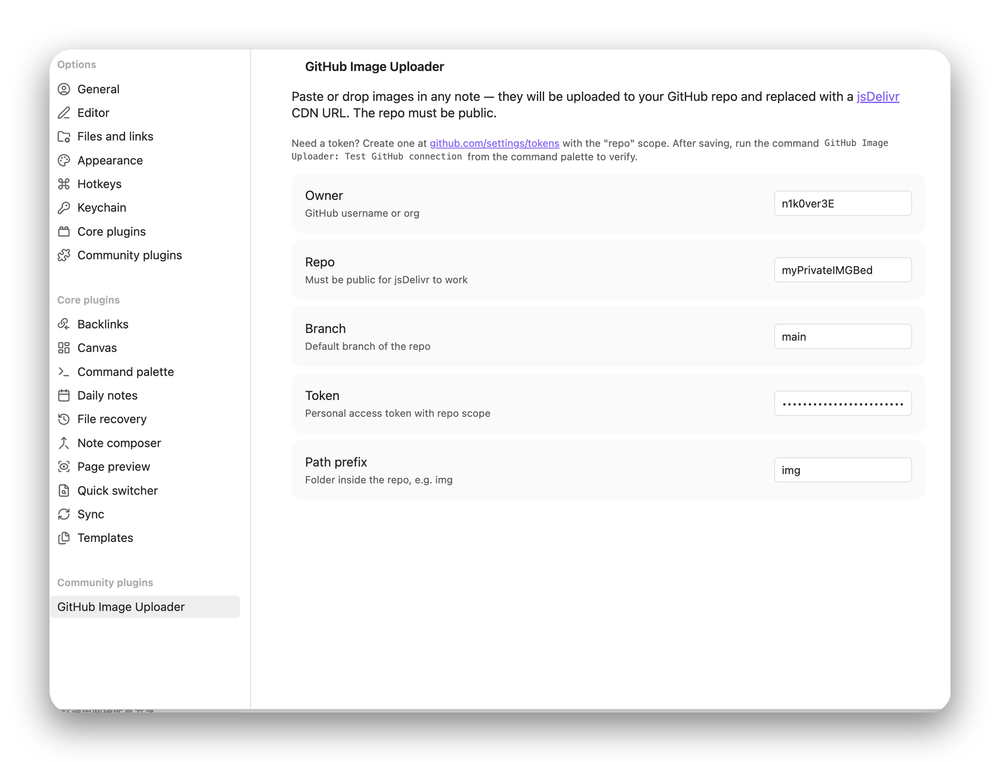

# Obsidian GitHub 图床插件

**中文** · [English](README.md)

在任意笔记里粘贴或拖入一张图 — 插件会自动把它上传到你的 GitHub 仓库，并把链接替换成 [jsDelivr](https://www.jsdelivr.com/) 的 CDN 地址。

不需要 PicGo，不需要后台进程，只需要一个 token。

## 特点

- 📋 **粘贴 & 拖拽** — 截图、图片文件都支持
- ⚡ **jsDelivr 加速** — 走全球 CDN，而不是 raw GitHub
- 🪶 **极简** — 打包后约 8 KB，零运行时依赖
- 📱 **跨平台** — 桌面 & 移动端都能用，无需辅助进程
- 🧪 **内置命令** — `Test GitHub connection` 一键校验配置

## 工作原理

```
粘贴图片 → 先插入  占位
        → PUT /repos/:owner/:repo/contents/:path （GitHub Contents API）
        → 把占位替换成 
```

上传失败的话占位会被清掉，并弹一个错误 toast。

---

## 安装

### 方式 A — 手动（目前推荐）

1. 进 [最新 Release](../../releases/latest)，下载 **`main.js`** 和 **`manifest.json`**
2. 在你的 vault 里建文件夹 `<your-vault>/.obsidian/plugins/github-image-uploader/`
3. 把两个文件丢进去

### 方式 B — 从源码构建

```bash
git clone https://github.com/n1k0ver3E/obsidian-image-uploader
cd obsidian-image-uploader
npm install
npm run build
# 把 main.js + manifest.json 复制到 <your-vault>/.obsidian/plugins/github-image-uploader/
```

---

## 你需要手动做的事（文件就位后）

> Obsidian 不会自动启用插件，下面这一段必须手动操作一次。

### 1. 在 Obsidian 里开启社区插件

- 打开 **设置 → 第三方插件**
- 如果你从来没用过第三方插件，会看到一个 **「Turn on community plugins」** 按钮（即所谓的「受限模式」）— 点掉它，确认 Obsidian 的安全提示即可

### 2. 启用本插件

- 在 **已安装插件** 列表里找到 **GitHub Image Uploader**，把右边的开关打开

### 3. 填写配置

点插件名字旁边的齿轮进入设置页，应该看到这样的面板：

<p align="center">
  
</p>

按下表填：

| 字段 | 值 |
|---|---|
| **Owner** | 你的 GitHub 用户名 |
| **Repo** | 作为图床的仓库名 — **必须是 public**，jsDelivr 不能加速私有库 |
| **Branch** | 仓库的默认分支（`main` 或 `master`） |
| **Token** | 去 [github.com/settings/tokens](https://github.com/settings/tokens) 建一个 classic Personal Access Token，scope 只勾 `repo` 就够 |
| **Path prefix** | 仓库内的子目录，比如 `img` 或 `obsidian/2026`。留空就上传到根目录 |

> 💡 还没有图床仓库？先去 GitHub 新建一个 **public** 仓库（名字随意，空的就行，插件会往里塞文件）。

### 4. 冒烟测试

1. 命令面板（`Cmd/Ctrl + P`）→ 跑 **GitHub Image Uploader: Test GitHub connection**，应该弹一个带最新 commit SHA 的 "OK" 提示。如果不是，看下面的错误对照表
2. 打开任意笔记，截个图，`Cmd/Ctrl + V` 粘贴。正常情况下：
   - 光标位置先出现 `` 占位
   - 一秒后占位被替换成 ``
3. 去 GitHub 仓库看一眼 — 应该多了一条 commit，里面是刚上传的图

---

## 出问题怎么排查

| 现象 | 可能原因 |
|---|---|
| 粘贴后没反应 | 开发者面板（`Cmd/Ctrl + Opt + I`）→ Console，找 `[GitHub Image Uploader]` 开头的日志 |
| `401` / `403` | token 无效、过期，或者没勾 `repo` scope |
| `404` | owner / repo / branch 拼错了，或者仓库是私有的 |
| `422` | 同名文件已经存在（很罕见 — 文件名带时间戳+随机后缀） |
| 链接在浏览器里 404 | jsDelivr 首次拉新文件可能要等 ~60 秒缓存，刷新一下 |
| 移动端粘贴没用 | 某些 iOS/Android 剪贴板来源不会把图片字节交给 Obsidian，可以试试用文件选择器拖入 |

---

## 安全提示

- 你的 token 以 **明文** 形式存在 `<vault>/.obsidian/plugins/github-image-uploader/data.json` 里。任何能读 vault 的人都能读到它
- 如果你同步 vault 到第三方（iCloud / Dropbox / Git 等），token 会跟着一起走。建议把这个文件加进 `.gitignore`，如果 vault 用 Git 管理
- 多人共享的 vault，建议用 [fine-grained token](https://github.com/settings/personal-access-tokens) 只授权给图床仓库

---

## 协议

MIT — 见 [LICENSE](LICENSE)
